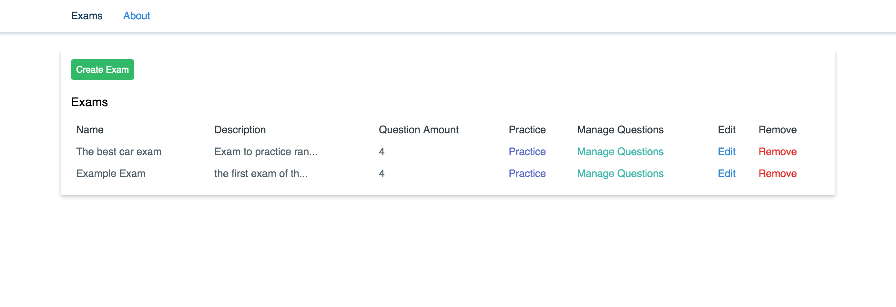
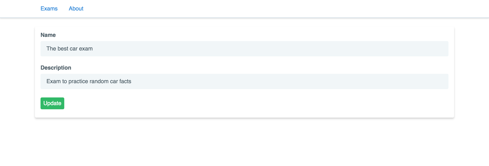
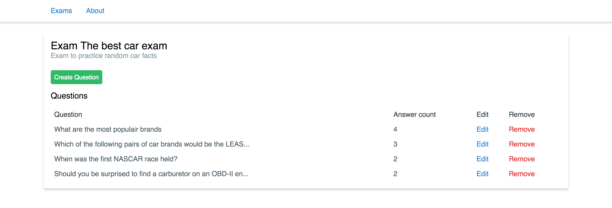
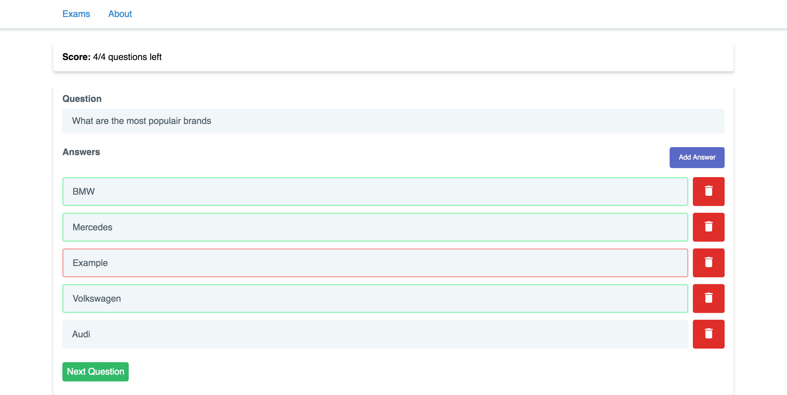

# Multi Questions 
React SPA to practice questions with multiple answers.

## Preview
#### Exam List

#### Edit Exam

#### Exam Questions

#### Edit Exam Questions


#### Practice mode


## Installation
```bash
git clone git@github.com:MaartenGDev/multi-questions.git
cd multi-questions
yarn install
```

## Development
```bash
# Run mix tasks(watching css and js files)
yarn dev
# Hot reloading for React
yarn hot
# Migrate database
php artisan migrate
```

## Production
```bash
yarn prod
```